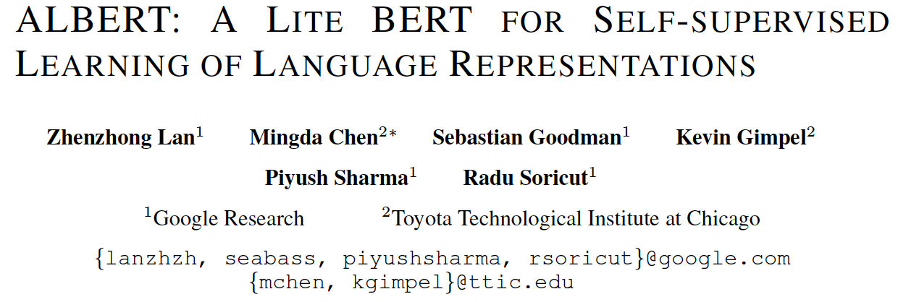

* 2024, Phong Nguyen*

  

- ALBERT proposes two techniques to lower memory consumption and improve training speed of BERT.
- Factorized embedding parameterization: splitting the embedding matrix $O(V \times H)$ into two matrices for a much smaller number of parameters $O(V \times E + E \times H)$ with
  - $V$: vocabulary size (~30,000)
  - $E$: vocabulary embedding size
  - $H$: model hidden size
- Cross-layer parameter sharing: just one set of parameters shared between all layers. The more parameters to share (attention, FFN, or all) the faster the model is but the worse it performs. Sharing parameters of a larger model gives SOTA results.
- ALBERT also suggests using sentence-order prediction instead of next sentence prediction. The model has to distinguish between consecutive segments and swapped consecutive ones, which is harder than distinguishing the next sentence and a random one.

