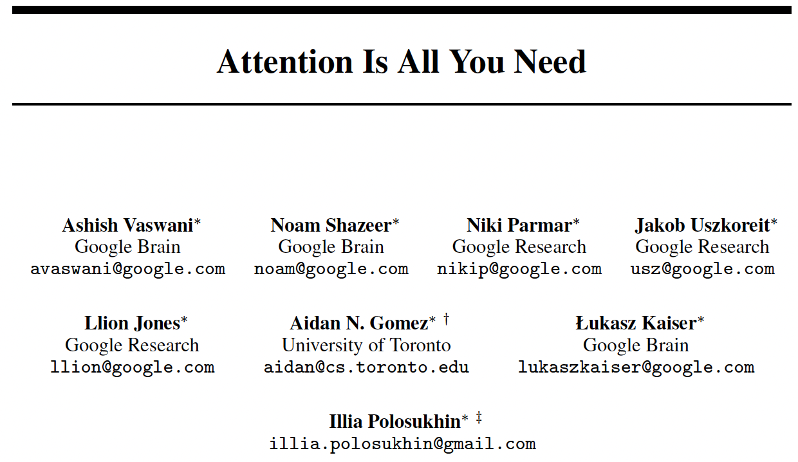
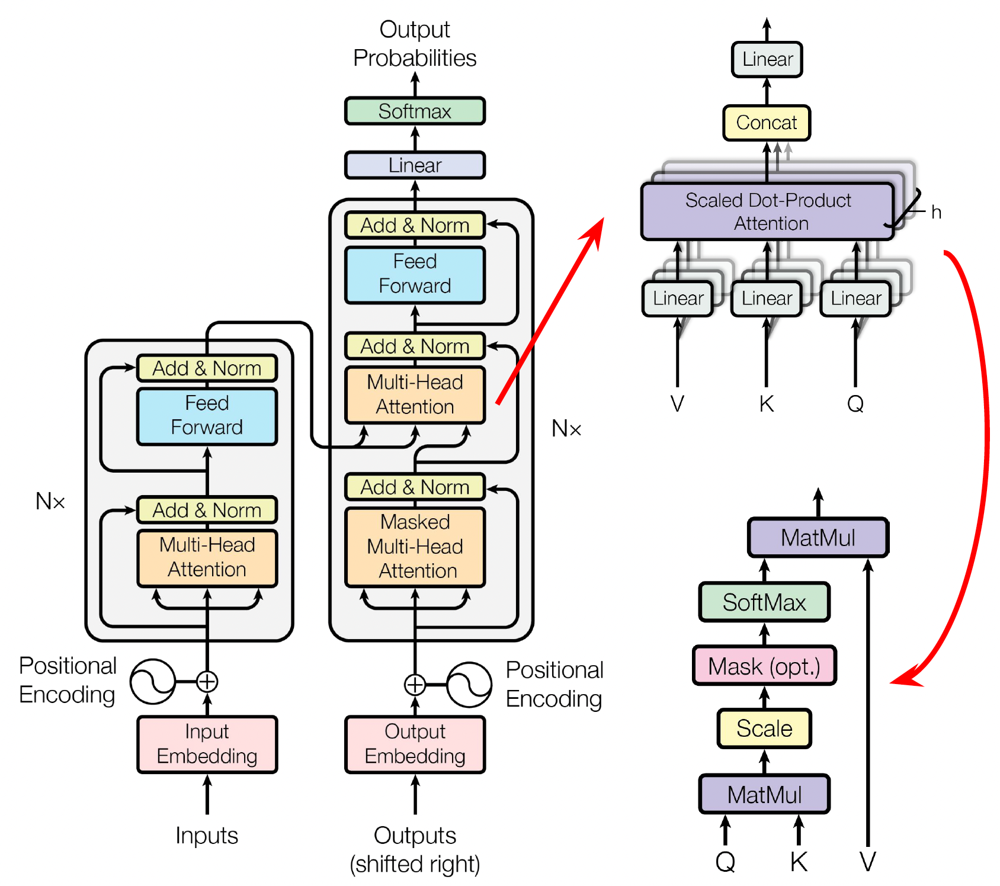

*8th Jan 2024, Phong Nguyen*

  

- This paper proposes an Encoder-Decoder architecture for machine translation without the involvment of recurrent or convolutional neural networks. It only uses attention mechanism. This architecture is extremely popular now and we all know that its decoder-only version is the heart of AI chatbots like ChatGPT.
- Positional encoding is used to represent the sense of order in the sequence. The paper uses a fixed formula.
- The encoder stacks mutliple blocks with the ouput can be considered as a more refined representation of the input that incorporates contextual information. Each output vector is not just a representation of a single token but contains aggregated information from other relevant tokens in the sequence.
- Each encoder block includes two components:
  - Self-attention: to learn relationship between tokens in the sequence (similar role to the convolutional layer in ConvS2S).
  - Feedforward: to add non-linearity and capacity.
  - Residual connection and layer normalization are also added for stability in training.
- A decoder block includes an extra component that learns cross-attention from the encoder.
- Diving into the attention module which is called 'multi-head attention':
  - In previous papers that use attention mechanism, the decoder hidden state $s_t$ attends to each encoder hidden state $h_i$ based on the attention score such as a dot product $e_{ti}=s_t^\top h_i$. Then the context vector is calculated as $c_t=\sum_{i=1}^{T_i}{\alpha_{ti}h_i}$, which $\alpha_{ti}$ is a softmax of $e_{ti}$.
  - Let's abstract that by mapping encoder hidden state to **input** $x_i$, decoder hidden state to **query** $q_t$, and context vector as **output** $y_t$. The input is actually used twice and we want to separate its usage: **key** $k_i$ to calculate the attention score and **value** $v_i$ to calculate the output. This is the exact terminology the paper uses!
  - For self-attention all three query, key, value are learned projection from the input. For cross-attention, the query comes from decoder and key/value come from the encoder.
  - The paper discovers that instead of performing a single large dimension $d_{model}$ attention, projecting it to $k$ separate smaller attentions and concatenating them at the end gives better performance.
  

  

