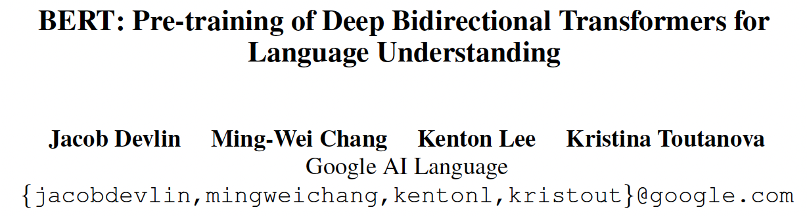
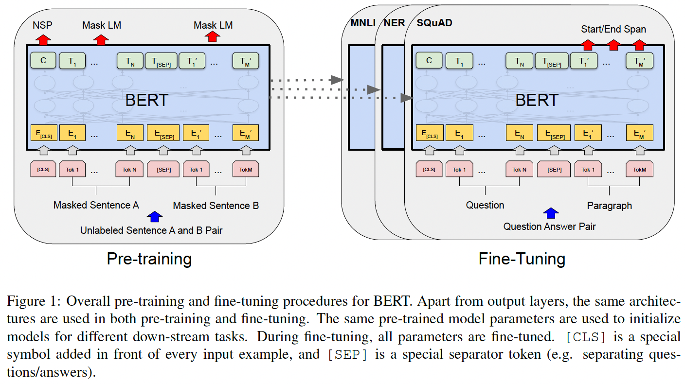
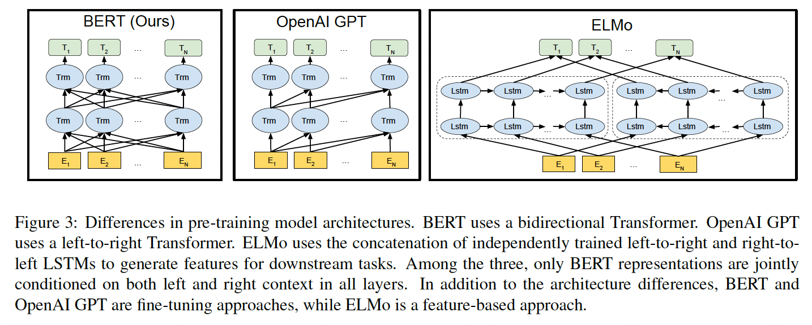

* 2024, Phong Nguyen*

  

- BERT is a language representation model that is trained with deep bidrectional transformers for language understanding.
- In the pre-training stage, two tasks are used: masked word prediction and next sentence prediction. The input includes two special tokens `[CLS]` that is designed to aggregate meaning of the input and `[SEP]` to separate two sentences in a pair.
- In the fine-tuning stage, the same architecture is reused with some minimal addition depending on the task. For example, in Question Answering (SQuAD), start vector $S$ and end vector $E$ are added. The fine-tuned model produces probability of each token in the paragraph section to be the start/end marker of the answer: $P_i=\text{softmax}(S.T_i)$.

  

- BERT is highly related to ELMo and GPT, using the same two-stage process: pre-training and fine-tuning.

| Model | Pre-training | Fine-tuning |
|-------|--------------|-------------|
| ELMo  | LSTM, shallow concatenation of left-to-right and right-to-left LMs. | Providing additional features for model-specific downstream tasks |
| GPT   | Left-to-right transformers, next word prediction | Same architecture with an dditional linear layer |
| BERT  | Bidirectional transformers, masked word prediction & next sentence prediction | Same architecture with an additional linear layer |

  

