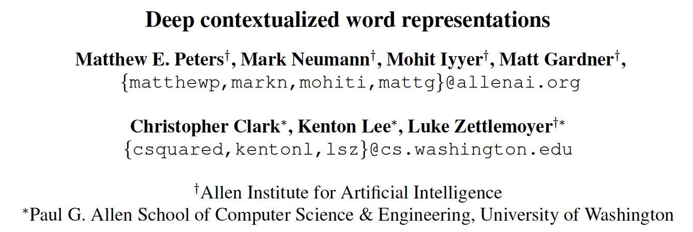

*9th Jan 2024, Phong Nguyen*

  

- This is one of the earliest papers that pretrains language models and applies the results for a variety of downstream tasks. 
- Previous approaches that learn word representations such as Word2Vec are static (a single vector for each word that could have multiple meanings depending on the context) and are learned with a limited context window.
- This paper uses a multi-layer bidirectional LSTM to pretrain word embeddings with language modelling task (predicting next word). A combination of the hidden states in all layers is used instead of the last layer alone: $R_k=\{x_k^{LM},\overrightarrow{h}_{k,j}^{LM},\overleftarrow{h}_{k,j}^{LM} | j=1,\cdots,L\}$.
- For each downstream task, the addition of ELMo representation was shown to boost the performance of all tasks to SoTA:
  - ELMo representation is learned as a softmax-normalized-weighted sum $\text{ELMo}_k = \gamma \sum_{j=0}^{L} s_j \cdot h_{k,j}$. 
  - The representation is then concatenated with context-independent representation like Word2Vec $[x_k;\text{ELMo}_k]$.