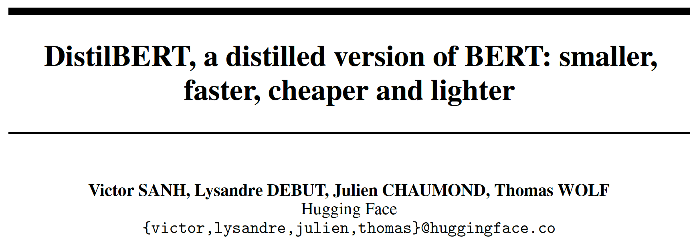

* 2024, Phong Nguyen*

  

- This paper proposes a lighter version (40% smaller) of BERT with comparable performance (97%). 
- It applies a teacher-student training mechanism with the student having the same architecture as BERT but with half of the layers.
- The objective loss includes language modelling, distillation (cross-entropy between predicted probabilities produced by the teacher and student) and cosine distance (probability alignment).

