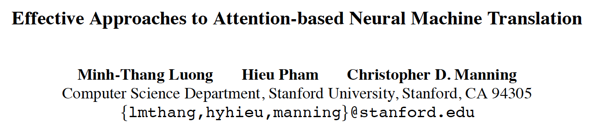

*4th Jan 2024, Phong Nguyen*

  

This paper explores different types of attention:
- In terms of scoping:
  - Global attention: considering all the encoder hidden states when calculating the context vector $$c_i=\sum_{j=1}^{T_x}{\alpha_{ij}h_j}$$
  - Local attention: focusing on a small window of context $[p_t-D,p_t+D]$ where $D$ is empirically selected and the aligned position $p_t$ is predicted as $$p_t=S.sigmoid(v_p^\top tanh(W_ph_t))$$ $W_p$ and $v_p$ are model parameters, $h_t$ is encoder hidden state, $S$ is length of input sentence.
- In terms of attention scoring between decoder hidden state $s_t$ and encoding state $h_i$:
  - dot product: $s_t^\top h_i$
  - general: $s_t^\top W_a h_i$, where $W_a$ is a trainable weight matrix
  - concat: $v_p^\top tanh(W_a[s_{t};h_i])$ (used in Bahdanau's paper)