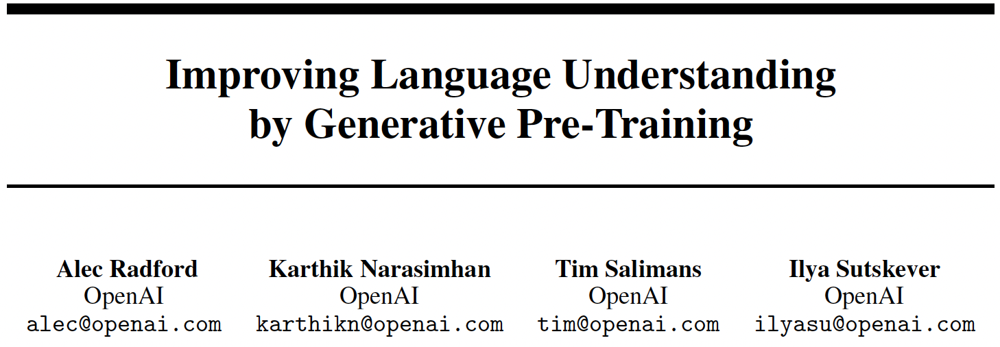
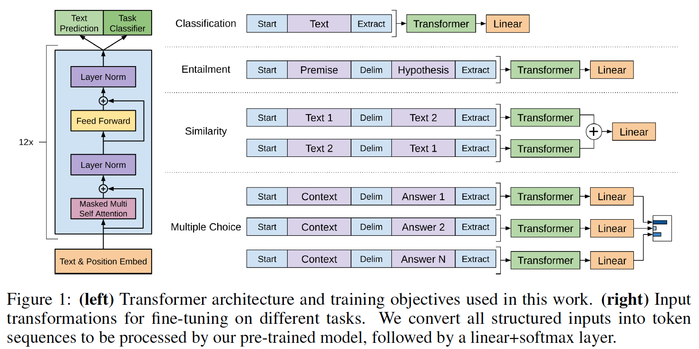

*10th Jan 2024, Phong Nguyen*

  

- This is the first paper in the famous GPT series and is one of the first papers that applies the transformer architecture to solve multiple language understanding tasks. 
- This is a two-stage process: 
  - First, train a language model for representation learning. It uses a decoder-only variant of transformer because there are no source and target sentences as in machine translation.
  - Then, for each downstream task, train a specific model with the previously learned representation input. Considering text classification as an example: sequence input $x_1,\cdots,x_m$ and label $y$. The inputs are passed through the pre-trained model to obtain the final transformer block's activation $h_L^{m}$ (of the last token). They are then used as input to a simple linear layer for classification.

  

