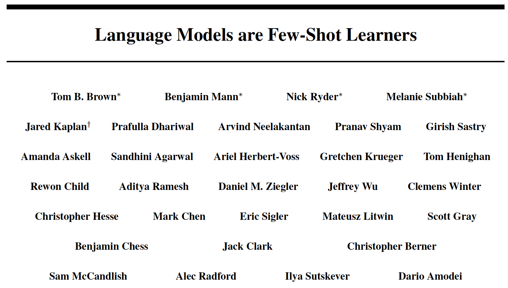
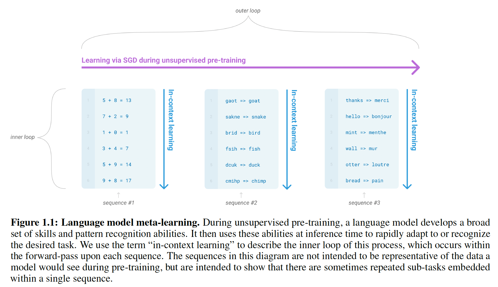

* 2024, Phong Nguyen*

  

- This giant transformer GPT-3 model with 175B parameters (GPT-2 has 1.5B parameters) really brings competitive performance in few-shot settings.
- The paper terms it `in-context learning`, where a task description and a few examples are provided into a prompt and no gradient update happens. The model learns a new task through the given context.

  

