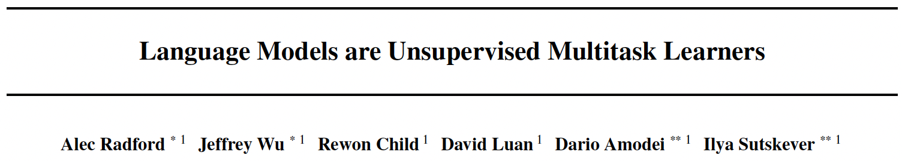
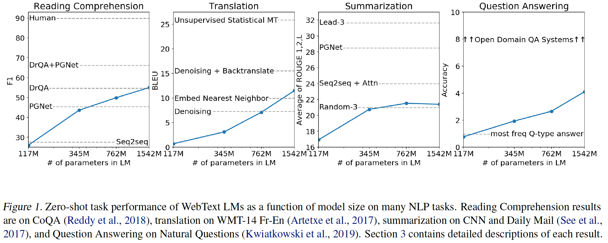

* 2024, Phong Nguyen*

  

- This GPT-2 model proposes a neat usage of language model. Language provides a flexible way to formulate a task as a sequence of words and word prediction objective is sufficient to solve the task. Word prediction is conditioned on both the input and task descrition $p(output|input,task)$. For example:
  - English-French translation is (`translate to French`, English text, French text).
  - Summarization is (original text, `TL;DR:`, summarized text).
- The model is trained on a huge dataset with a large Transformer archictecture for word prediction objective. 
  - A new dataset, WebText, is collected based on high quality (human upvoted) links from Reddit. After cleaning, WebText contains over 8 million documents for a total of 40GB of text.
  - The largest model has 1.5B parameters (GPT-1 has 117M and BERT has 340M parameters).
- The model achieves state of the art performance in zero-shot language modelling task in most of other datasets that it does not use to train.
- Most interestingly, the model shows its promising result in zero-shot settings of language understanding tasks without fine-tuning.

  

