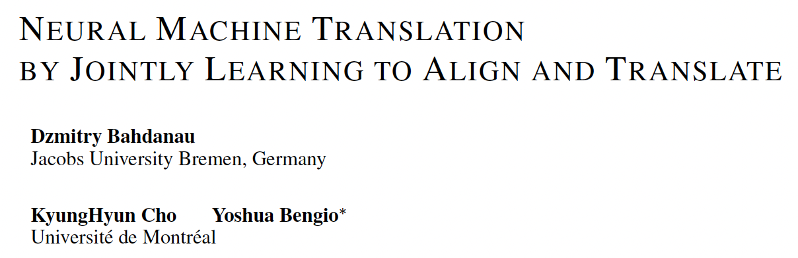
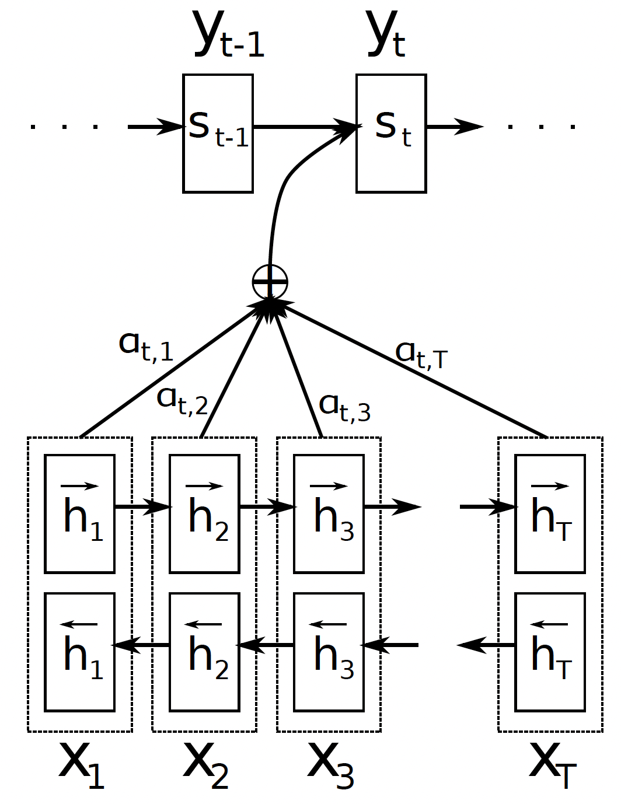

*3rd Jan 2024, Phong Nguyen*

  

- The first paper to propose **attention** mechanism for natural language processing, with a different name - alignment.
- Use an RNN Encoder-Decoder architecture as recently proposed: the decoder is trained to predict the next word $y_{i}$ given the context vector $c$ and all previously predicted words $y_1, \dots , y_{i-1}$.
  - Notation: $h_i$ is the encoder hidden state at time $i$ and $s_i$ is the decoder hidden state at time $i$.
  - $p(y_i | \{y_1, \ldots, y_{i-1}\}, c) = g(y_{i-1}, s_i, c)$ where $g$ could be a simple linear layer and $s_i = decoder(y_{i-1}, s_{i-1}, c)$
- The limitation of this architecture is the use of a single fixed-length vector $c$ in decoding at every time step. This paper proposes to use a different vector $c_i$ for each time step $i$, allowing each context vector pays attention to different source words in the input sentence. It's calculated as a weighted sum over all encoder hidden states: $$c_i=\sum_{j=1}^{T_x}{\alpha_{ij}h_j}$$
- $\alpha$ is the weight calculated as softmax of attention score: $$\alpha_{ij}=softmax(score(s_{i-1},h_j))$$
- Attention score is parameterized as a feedforward neural network (a matrix multiplication followed by a non-linear and a vector multiplication to get a scalar): $$score(s,h)=v^\top tanh(Ws+Uh)$$

  

