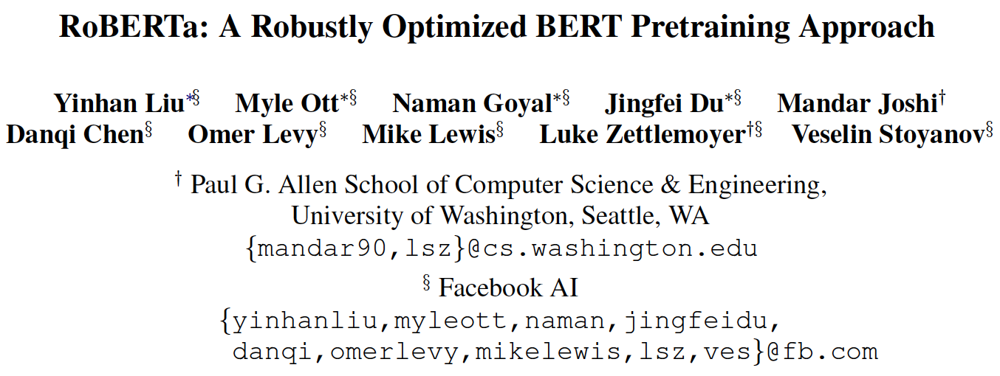

* 2024, Phong Nguyen*

  

- This paper proposes a number of modification to the training details of BERT and achieves SOTA results in several benchmarks.
- It removes next sentence prediction objective, trains for longer sequences in bigger batches. It also changes the masking pattern the of masked tokens dynamically.

